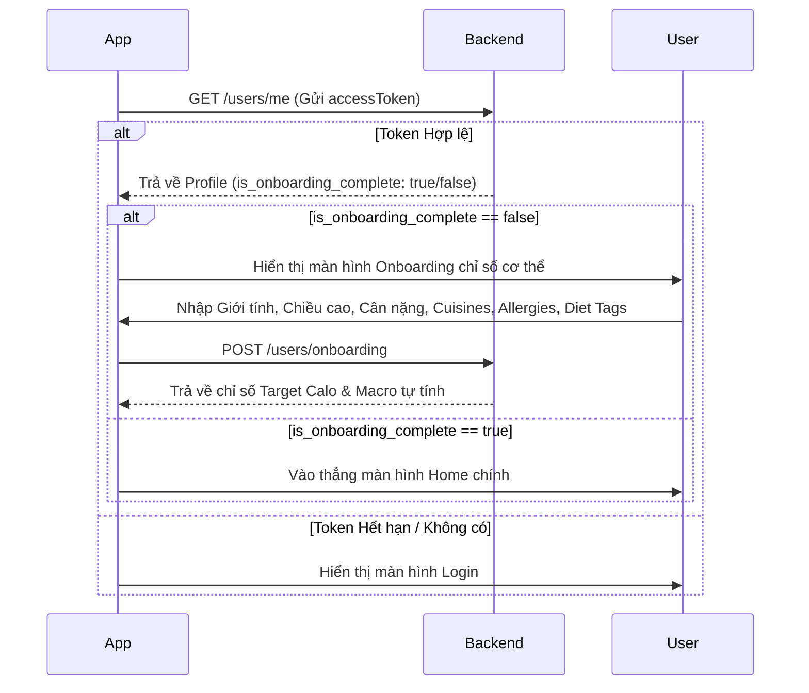

# 🍽️ Tastee Backend API - Hướng dẫn Tích hợp dành cho Frontend (Mobile/Web)

Chào mừng bạn đến với tài liệu hướng dẫn tích hợp Backend của ứng dụng **Tastee** – Trợ lý dinh dưỡng & Lên kế hoạch ăn uống cá nhân hóa.

Mặc dù hệ thống đã có sẵn **Swagger UI** trực quan để chạy thử trực tiếp tại địa chỉ:
👉 **[http://localhost:3000/docs](http://localhost:3000/docs)**

Tuy nhiên, tài liệu `README.md` này sẽ cung cấp cho phía Frontend (đặc biệt là **Android/Java Developer**) cái nhìn toàn cảnh về quy trình tích hợp tuần tự (Workflows), cấu trúc dữ liệu chuẩn và các mẹo tích hợp bằng Retrofit/OkHttp.

---

## 🛠️ 1. Hướng dẫn chạy Backend cục bộ

Nếu bạn muốn khởi chạy server API dưới máy của mình để dev:
1. Đảm bảo đã cài đặt **Node.js** (v18+) và **PostgreSQL**.
2. Nhân bản dự án, sao chép file `.env.example` thành `.env` và điền cấu hình cơ sở dữ liệu (`DATABASE_URL`).
3. Khởi chạy cài đặt dependencies và chạy server:
   ```bash
   npm install
   npm run dev
   ```
4. Server sẽ lắng nghe tại cổng `3000`. Endpoint kiểm tra sức khỏe hệ thống:
   `GET http://localhost:3000/health`

---

## 📊 2. Cấu trúc Response chuẩn (Standard Payload)

Tất cả các API của Tastee đều tuân thủ định dạng JSON thống nhất để Frontend dễ dàng viết Parser mẫu (Generic Models).

### 2.1 Cú pháp Thành công (Single Object)
```json
{
  "success": true,
  "data": {
    "id": "7c12850d-d421-4f3b-b27a-e4618e47bf03",
    "name": "Nguyễn Văn A"
  },
  "message": "OK"
}
```

### 2.2 Cú pháp Thành công có Phân trang (Danh sách)
```json
{
  "success": true,
  "data": [...],
  "pagination": {
    "page": 1,
    "limit": 20,
    "total": 150,
    "totalPages": 8
  }
}
```

### 2.3 Cú pháp Lỗi chuẩn hóa
```json
{
  "success": false,
  "error": {
    "code": "VALIDATION_ERROR",
    "message": "Thiếu các thông tin bắt buộc"
  }
}
```

---

## 🔑 3. Quản lý Authentication & Token (JWT Flow)

Hệ thống sử dụng cơ chế bảo mật kép: **Access Token** (hạn ngắn 15 phút) gửi ở Header và **Refresh Token** (hạn dài 7 ngày) gửi ở Body để cấp lại token khi hết hạn.

1. **Đăng nhập / Đăng ký**:
   - `POST /auth/register` (Đăng ký)
   - `POST /auth/login` (Đăng nhập) -> Trả về `accessToken` và `refreshToken`.
2. **Lưu trữ**:
   - Lưu `accessToken` và `refreshToken` vào bộ nhớ an toàn của thiết bị (Android: `EncryptedSharedPreferences`).
3. **Gửi Token**:
   - Đính kèm `accessToken` vào header của các request được bảo vệ:
     `Authorization: Bearer <accessToken>`
4. **Hết hạn Token (HTTP 401)**:
   - Khi nhận mã lỗi `401 Unauthorized` với mã lỗi `TOKEN_EXPIRED`, thực hiện gọi API:
     `POST /auth/refresh` gửi kèm `{ "refreshToken": "..." }`.
   - Lưu lại `accessToken` mới và tự động thực hiện lại (Retry) request bị lỗi trước đó.
   - Nếu gọi Refresh Token bị lỗi `401` tiếp (`REFRESH_TOKEN_INVALID`), điều hướng người dùng về màn hình Đăng nhập (Logout cứng).

---

## 🔄 4. Quy trình Tích hợp Tuần tự (Integration Workflows)

Dưới đây là sơ đồ hướng dẫn tích hợp logic ứng dụng từ lúc mở app đến khi gợi ý món ăn:

### L luồng 1: Khởi động App & Onboarding


### Luồng 2: Tra cứu & Lên lịch Ăn uống (Meal Planning)
1. **Tìm món ăn**: `GET /foods/search?q=chicken`
   - Hiển thị danh sách kèm lượng dinh dưỡng (Calories, Protein, Carbs, Fat) trên 100g.
2. **Lên lịch bữa ăn**: `POST /meals`
   - Gửi `{ "foodId", "scheduledAt", "quantityG" }`.
   - Nhận về thông tin bữa ăn đã được lưu kèm lượng dinh dưỡng thực tế tính theo gram (`calories_snap`, v.v.).
3. **Xem lịch trình ngày**: `GET /meals?date=YYYY-MM-DD`
   - Trả về danh sách món ăn đã xếp lịch theo thứ tự thời gian tăng dần.
4. **Xem tổng hợp tiến trình**: `GET /summary/daily?date=YYYY-MM-DD`
   - Trả về báo cáo tiến độ dưới dạng: Đã nạp (`actual`), Cần nạp (`target`), Còn lại (`remaining`) và Tỉ lệ phần trăm (`percentage`). Dùng để vẽ thanh ProgressBar dinh dưỡng ở màn Home.

### Luồng 3: Gợi ý món ăn thông minh (Recommendation)
- Gọi API: `GET /recommend?date=YYYY-MM-DD`
- Backend tự động:
  - Tính khẩu vị của người dùng bằng cách tính trung bình cộng Vector Embedding (Centroid) từ lịch sử ăn uống của họ trước ngày truy vấn.
  - Lọc bỏ 100% món ăn chứa thành phần dị ứng (`allergies`) đã chọn ở màn Onboarding.
  - Cộng điểm ưu tiên cho các món ăn phù hợp với chế độ ăn kiêng (`diet_tags`) và sở thích (`cuisines`).
- Trả về danh sách **20 món ăn gợi ý cá nhân hóa** xếp hạng theo điểm số `score` giảm dần.

---

## 🚨 5. Bảng mã lỗi dùng chung (Shared Error Codes)

Frontend nên có một file Class/Enum để ánh xạ (Map) mã lỗi từ Backend và hiển thị Toast/Dialog phù hợp cho người dùng:

| Mã lỗi (Code) | HTTP Status | Ý nghĩa | Hành động của Frontend |
|---|---|---|---|
| `VALIDATION_ERROR` | `400` | Dữ liệu gửi lên bị thiếu, sai định dạng (ví dụ: ID không phải UUID) | Kiểm tra lại dữ liệu nhập từ form / Validate client |
| `EMAIL_ALREADY_EXISTS` | `400` | Email đăng ký đã được sử dụng | Thông báo: "Email này đã tồn tại" |
| `ONBOARDING_REQUIRED` | `400` | Truy cập API Meal/Recommend khi chưa làm Onboarding | Tự động chuyển hướng người dùng sang màn Onboarding |
| `TOKEN_INVALID` | `401` | Token không hợp lệ hoặc sai chữ ký | Điều hướng ra màn hình Đăng nhập |
| `TOKEN_EXPIRED` | `401` | Access Token hết hạn | Gọi API `/auth/refresh` để lấy token mới |
| `REFRESH_TOKEN_INVALID` | `401` | Refresh token hết hạn hoặc giả mạo | Đăng xuất người dùng, yêu cầu đăng nhập lại |
| `NOT_FOUND` | `404` | Món ăn, Bữa ăn hoặc Profile không tồn tại | Thông báo: "Dữ liệu không tồn tại hoặc đã bị xóa" |
| `TOO_MANY_REQUESTS` | `429` | IP gửi quá nhiều request (Bảo vệ Rate limit) | Hiển thị: "Bạn đang thao tác quá nhanh, vui lòng thử lại sau" |
| `INTERNAL_ERROR` | `500` | Lỗi phát sinh trong server | Hiển thị: "Hệ thống đang gặp sự cố, vui lòng thử lại sau" |

---

## 📱 6. Một số mẹo tích hợp hữu ích dành cho Android (Java/Retrofit)

### 6.1 Cấu hình Header Token tự động bằng OkHttp Interceptor
Thay vì truyền thủ công `@Header("Authorization")` trong mỗi hàm ApiService, hãy cấu hình một `Interceptor` khi khởi tạo `OkHttpClient`:

```java
OkHttpClient okHttpClient = new OkHttpClient.Builder()
    .addInterceptor(chain -> {
        Request original = chain.request();
        
        // Lấy Token đã lưu trong SharedPrefs
        String token = SharedPreferencesHelper.getAccessToken(); 
        
        if (token != null && !token.isEmpty()) {
            Request request = original.newBuilder()
                .header("Authorization", "Bearer " + token)
                .method(original.method(), original.body())
                .build();
            return chain.proceed(request);
        }
        
        return chain.proceed(original);
    })
    .build();
```

### 6.2 Cấu hình Auto-Authenticator để tự động làm mới Token (Refresh Flow)
Sử dụng hàm `.authenticator()` của OkHttp để tự động đón đầu lỗi 401, gọi `/auth/refresh` đồng bộ, lưu token mới và gửi lại request lỗi:

```java
okHttpClientBuilder.authenticator((route, response) -> {
    // 1. Chỉ thực hiện khi nhận mã 401
    if (response.code() == 401) {
        String refreshToken = SharedPreferencesHelper.getRefreshToken();
        
        // Gọi API refresh token đồng bộ
        Call<RefreshResponse> call = apiService.refreshTokenSync(new RefreshRequest(refreshToken));
        retrofit2.Response<RefreshResponse> refreshResponse = call.execute();
        
        if (refreshResponse.isSuccessful() && refreshResponse.body() != null) {
            String newAccessToken = refreshResponse.body().getData().getAccessToken();
            String newRefreshToken = refreshResponse.body().getData().getRefreshToken();
            
            // Lưu token mới
            SharedPreferencesHelper.saveTokens(newAccessToken, newRefreshToken);
            
            // Gửi lại request cũ với Access Token mới
            return response.request().newBuilder()
                .header("Authorization", "Bearer " + newAccessToken)
                .build();
        }
    }
    return null; // Trả về null nếu refresh thất bại -> Chuyển về màn Login
});
```

### 6.3 Ép kiểu dữ liệu Array (TEXT[] và FLOAT[])
Các trường như `cuisines`, `allergies`, `tags` trong Database PostgreSQL trả về dưới dạng JSON Array thông thường (`["vietnamese", "italian"]`).
- Phía Java, bạn khai báo các thuộc tính này dưới dạng `List<String>` hoặc `String[]`.
- Đối với trường độ tương đồng trong Recommend, hãy ép sang kiểu `Double` hoặc `Float` để tránh mất mát dữ liệu phần thập phân.
